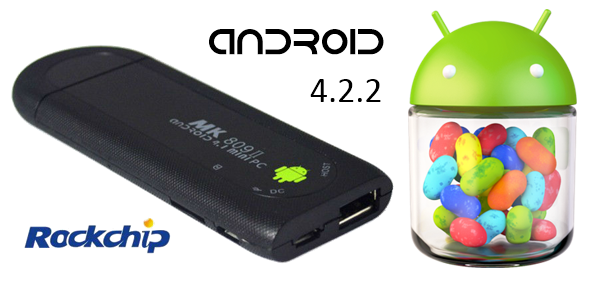
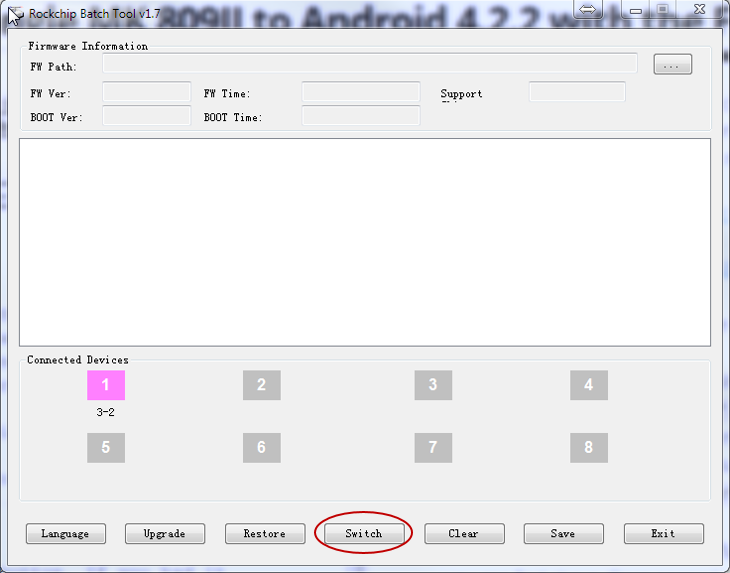
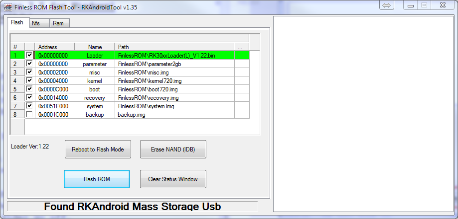

title=How to upgrade your HDMI dongle MK809II to Android 4.2.2 with the Finless ROM 2.0
date=2014-01-12
author=Angel Ruiz
type=post
tags=android, hack
status=published
~~~~~~

This post is a concise and comprehensive summary of the steps I have followed to upgrade my HDMI dongle MK809II (Rochip RK3066 chipset) to use the **4.2.2** version of **Android**.

After reading plenty of confusing guides, finally I stambled upon this  video bellow which explains the process for the older 1.7 version of the Finless ROM. But if all you want is to flash a ROM, you can **skip to the 26:30 minute**.

<iframe width="560" height="315" src="//www.youtube.com/embed/VYdMydq7css" frameborder="0" allowfullscreen></iframe>

Once I watched the video, I had to search for un updated version of the ROM, tools and drivers, as the Finless ROM version 1.7 that appears on the video is based on Android 4.1.1. For your conveniece, I have included here all the files that are required to flash the new ROM:

- [Finless ROM 2.0 for imito MX1 and MX2 devices (compatible) + the ROM Flashing tool RKAndroidTool 1.35](https://dl.dropboxusercontent.com/u/8256463/blog-files/imito_mx1_2_finless_20_jb422.zip).
- [Rockchip Batch Tool 1.7 + Rock USB drivers 3.5 for Windows](https://dl.dropboxusercontent.com/u/8256463/blog-files/Rockchip_Batch_Tool_v1.7.rar).

Disclaimer!! Perform these steps at your own risk. I performed them succesfully in my device, but there is not 100% guaratee that you won't have some sort of issue along the way.

Next are the steps I followed to flash de ROM:

1. Connect your device to your PC using the microUSB connector located at the bottom which is labeled as `"DC"`. 
Remember that in order to provide with enough electric current, generally you need to connect the device to either a USB 3.0 port, 2 USB 2.0 ports or a USB 2.0 hub with external power supply.

2. Enable the option `"Connect to PC"`in your device. This options is located under `Settings -> USB`.

3. Now we need to set the device in flash mode. To do that we will use the rockchip batch tool that you can find above. Once opened you should see something similar to this screenshot:

4. All you need to do is click on the `"Switch"` button. If you had it connected to a screen you should see the video go off.

5. The first time you do this, Windows will try to install the new device without success and that is why you have the drivers included in one of the files listed above. Use the `"Windows Device Manager"` to install the drivers.

6. Now is time to open the ROM Flash tool `"RKAndoidTool"` included with the ROM. The only thing you would need to select here is if you want to use the Boot/Kernel for a 720p or a 1080p native resolution:

7. Notice that in the footer of the tool, it should appera the message: `"Found RKAndroid Mass Storage USB"`. If that's the case, you are good to press the `"Flash ROM"` button.

8. Once it is finished the device will reboot itself. Please be patient and wait for the first boot to happen.

I hope you find it useful. Please let me know if you have any problems.

Cheers,
