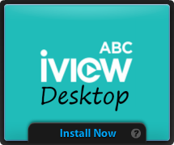
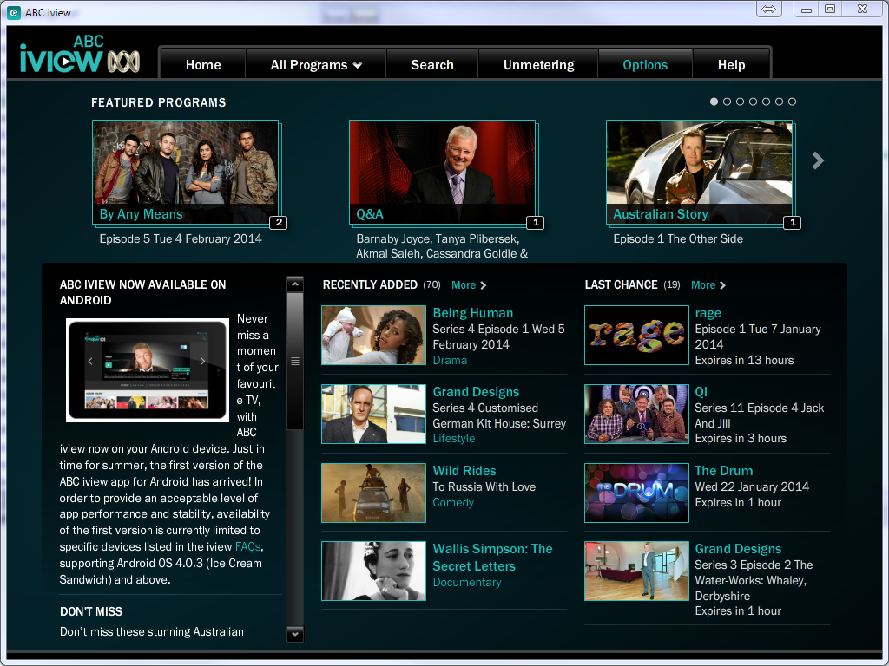

title=ABC iView Desktop - Using Adobe AIR to wrap your Web Application as a cross-platform Desktop Application
date=2014-01-28
author=Angel Ruiz
type=post
tags=adobe-air, desktop, web-apps
status=published
~~~~~~


## What is it?

I have known about the [Adobe AIR runtime](https://get.adobe.com/air/) and its concept for quite a long time, which were initially introduced back in 2007. It was an attempt to bridge the existing gap between the desktop and browser based apps, keeping as many of their respective advantages as possible.

For what I know, basically there are two ways of using Adobe AIR:

1. You can develop an application using web technologies like HTML or Flash/[Flex](http://www.adobe.com/au/products/flex.html) expecifically targeting this distribution platform, or 
2. You can develop your web application as usual and then wrap it around this "envelope".

<div class="index-break"></div>

Probably, the most important Abobe Air application to ever exist using the first approach was the version of **Tweetdeck** that existed before it was adquired by Twitter and decided to replace it with a worse native implementation IMO, with less features and "heavier". It sort of works, but since Twitter changed their APIs, it does not retrieve any messages. If you want to try the last version (0.38.2) anyway click [**here**](https://dl.dropboxusercontent.com/u/8256463/blog-files/TweetDeck_0_38.2.air). 

Another instance I normally use is a little application called ["Pomodairo"](http://code.google.com/p/pomodairo/). It aims to replace the physical timer for those who use the ["Pomodoro Technique"](http://pomodorotechnique.com/) to increase their productivity. A more well know app built in Adobe Air would be the prototyping tool called [balsamiq](http://balsamiq.com/download/).


The second approach, which is the one covered in this post, is the easiest.
The first time I thought about it was when I tried to use [Trello](https://trello.com/). Given the way I work or how my brain works, or both, somehow I found it cumbersome to have it opened in one tab of my browser and then I thought that maybe someone felt the same way and used Adobe Air to wrap it. <a href="https://trello.com/" target="_blank"></a>That is the moment when I came acroos [TrelloDesktop](http://trellodesktop.com/) (**Note**: Sign-in page not working at the time of writing this article).
<div>

There are some other examples like <a href="http://www.robertnyman.com/gmdesk/" target="_blank">GMDesk</a> to run GMail, Google Calendar, Docs and Maps as a desktop application. You also have <a href="http://www.robertnyman.com/facedesk/" target="_blank">FaceDesk</a> to do the same with Facebook and many others.

<a name="linux-support-info"></a>
<p></p>

<div class="alert alert-warning">
<i class="fa fa-exclamation-triangle fa-fw"></i> <strong>Important note!!</strong><br/>
After finishing this post, I realized that <strong>Adobe Air does not support Linux anymore</strong> as you can see in their <a href="http://www.adobe.com/products/air/tech-specs.html" target="_blank">system requirements page</a>. According to Adobe, they decided to drop Linux support after version 2.6 due to little demand from this platform and in order to shift more efforts to Phonegap. Personally I think that complete cross-platform compatibility was its main competitive advantage. You can check their <a href="http://www.adobe.com/au/products/air/faq.html#linux" target="_blank">FAQ</a> reagarding this matter. I understand that this is a kind a deal breaker for many :-( The only viable alternative is to use Adobe Air on Linux is to use <a href="http://appdb.winehq.org/objectManager.php?sClass=application&iId=5842" target="_blank">Wine</a>. There is no problem too big with a bit of wine XDD
</div>

## Why did I use it?

As you can see, the main scenario where an approach like this could be interesting is to wrap [SPI (Single Page Interface) applications](http://en.wikipedia.org/wiki/Single-page_application). It is of course a matter of personal preference as there is not a clear advantage of doing this unless, like me you agree with these points:

* In a browser is not very easy to switch to the right tab using the keyboard.
* From time to time your browser instance is closed either by accident or a crash.
* With the advent of mobile apps it happens that an SPI app sometimes feels like it is more convenient as a desktop app without the browser menus, url bars and back and forth buttons issues.

I got into creating my own desktop application using Adobe Air as I was trying to watch one of the ["Kevin McCloud's Grand Designs"](http://en.wikipedia.org/wiki/Grand_Designs) episodes using the ABC iView web application, which is a Flash App. There I thought I'd rather have this as a separate app as it should not be very difficult using this platform. So next I am going to put the steps I followed to create my own cross platform "ABC iView Destop" app, although **it would apply to any app you'd like to wrap**.

## Steps:

### 1. Download Adobe Air SDK
It can be downloaded from the following [link](http://www.adobe.com/devnet/air/air-sdk-download.html). At the time of writing this post, the available version of the runtime was the __4.0__).

### 2. Install Adobe Air SDK
It is as easy as unzipping the previous downloaded file in a location of your choice and then add the path to the SDK `/bin` folder to your `PATH` system variable.

### 3. Create Air application description
Firt of all we create an xml file with the name of our choice. In this instance I called it `application.xml`.

This file will contain the basic properties of our application. To know more about the available elements have a look at this [document about setting application properties](http://help.adobe.com/en_US/air/build/WS2d929364fa0b81374fa5df4f129dca62884-8000.html) and at the  [**the reference guide**](http://help.adobe.com/en_US/air/build/WS5b3ccc516d4fbf351e63e3d118666ade46-7ff1.html).

Next there is the application description for the iView-Desktop app:

```
<?xml version='1.0' encoding='utf-8'?>
<application xmlns="http://ns.adobe.com/air/application/3.7">
	<id>iViewDesktop</id>
	<name>iView - Desktop</name>
	<filename>iViewDesktop</filename>
	<versionNumber>1.0.0</versionNumber>
	<installFolder>iView-Desktop</installFolder>
	<initialWindow>
		<title>iView - Desktop</title>
		<content>redirect.html</content>
		<systemChrome>standard</systemChrome>
		<transparent>false</transparent>
		<visible>true</visible>
		<resizable>true</resizable> 
		<renderMode>direct</renderMode>
		<aspectRatio>landscape</aspectRatio> 
		<autoOrients>true</autoOrients>
		<width>1024</width>	
		<height>768</height>	
	</initialWindow>
    <icon>
        <image16x16>icons/iview-16x16.png</image16x16>
        <image32x32>icons/iview-32x32.png</image32x32>
        <image48x48>icons/iview-48x48.png</image48x48>
        <image128x128>icons/iview-48x48.png</image128x128>
    </icon>
</application>
```

As you can appreciate the [initialWindow -> content node](http://help.adobe.com/en_US/air/build/WSfffb011ac560372f2fea1812938a6e463-8000.html#WSfffb011ac560372f2fea1812938a6e463-7ff4) is the most important property, as it contains the URL relative to the root of the application installation folder. This URL points to the `.HTML` or `.SWF` file that contains your app.

### 4. Point to the web app URL
For this particular case of the ABC iView app I though it would be enough to download the '.SWF' file and reference it in the content property. For some reason I don't know it did not work. So at the end, I just created a HTML file that contains a script with a redirection to the iView URL:

```
<!DOCTYPE html>  
<html lang="en">
<head>
  <meta http-equiv="Content-Type" content="text/html; charset=UTF-8">
  <meta http-equiv="X-UA-Compatible" content="IE=edge,chrome=1">

  <script src="AIRUpdater-1.0.js"></script> 
</head>
<body>
<script>
  window.location.replace("http://www.abc.net.au/iview");  
</script>
</body>
</html>
```

Just replacing the URL you can pretty much load any web application you want.

### 5. Integrate an automatic upgrade mechanism (optional)

This step is optional but recommended, as it enables the application to be able to check if there is a new version at start up time and install the upgrade almost automatically.

There is a project called [AirUpdater](http://code.google.com/p/airupdater/) which provides a sample script to achieve this just by modifying a few URLs, the application name and  by following the instricutions included as inline comments. As you can see in the html file above, this script has been customized and included.

### 6. Checking that your app is working
Using the Adobe Air Debug Launcher (ADL) command-line tool that comes with the SDK, we can run our application without packaging and installation to check that everything is working all right. If the step 1 was performed correctly, you would just need to type in the following command from your project root folder:

`adl application.xml`

### 7. Creating some icons (optional)
The icons are used as the application file, shortcut, and program menu icons. The application icon should be supplied as a set of at least 16x16, 32x32, 48x48, and 128x128 pixels PNG images. But more if required can also be specified. If those are not provided the default ones will be used. 

Specify the path to the icon files [in the icon element of the application descriptor file](http://help.adobe.com/en_US/air/build/WSfffb011ac560372f2fea1812938a6e463-8000.html#WSfffb011ac560372f2fea1812938a6e463-7ff6). Have a look at the application descriptor above to see one example.

### 8. Generate a digital certificate to sign the installation package (optional)
This step is not optional if you don't have a legit digital certificate.

To generate your own certificate just type in the following command making the modifications you consider appropriate.

`adt -certificate -cn mycertificate 1024-RSA mycertificatefile.p12 password`

### 9. Package and sign the application
Next is the command I used to generate the `.air` package.


Please note that all the files that are to be packaged should be explicitly referenced. Otherwise you will get the famous **"[error 303: icon xxx is missing from package](https://www.google.com.au/search?q=error+303%3A+icon+xxx+is+missing+from+package&ie=utf-8&oe=utf-8&aq=t&rls=org.mozilla:en-US:official&client=firefox-a&gfe_rd=cr&ei=phDuUsXVJqeN8Qfz9oHYBQ#q=adobe+air+error+303:+is+missing+from+package&rls=org.mozilla:en-US:official)"**.

```
adt -package -storetype pkcs12 -keystore mycertificatefile.p12 iView-Desktop.air application.xml redirect.html AIRUpdater-1.0.js icons\iview128.png icons\iview16.png icons\iview32.png icons\iview48.png
```

### 10. Create launcher page (optional)
To distribute your app you can create a page like the ones used in the apps I put as examples earlier.
<a href="http://iview-desktop.aruizca.com/" class="right" target="_blank">

</a>

In those you can appreciate that they all use a flash component to trigger the installation. This component seamlessly takes care of installing the app and  the Adobe Air Runtime if it is not already installed in the system.

The installer badge is a flash component usually distributed in the samples included in the SDK, but there is a better resource in this Adobe tutorial:[**"Getting started with the custom install badge"**](http://www.adobe.com/devnet/air/articles/badge_for_air.html).


### 11. App. Installation
Either through the installation badge or just clicking on the .air package generated on step 9 (if you have the Adobe Air runtime already installed), you should be able to install the app and run it. If succesful you should see something like this snapshot:



## Resources summary
* [ABC iview-desktop app website.](http://iview-desktop.aruizca.com/)
* [Source code in GitHub.](https://github.com/aruizca/iview-desktop)
* [Adobe Air Runtime.](https://get.adobe.com/air/)
* [Adobe Air SDK.](http://www.adobe.com/devnet/air/air-sdk-download.html)
* [Guide: "Developing AIR applications for the desktop".](http://help.adobe.com/en_US/air/build/WSfffb011ac560372f20b57e08128cc91aa2f-8000.html)
* [Adobe Air application descriptor reference guide.](http://help.adobe.com/en_US/air/build/WS5b3ccc516d4fbf351e63e3d118666ade46-7ff1.html)
* [Article: "Getting started with the custom install badge".](http://www.adobe.com/devnet/air/articles/badge_for_air.html)
