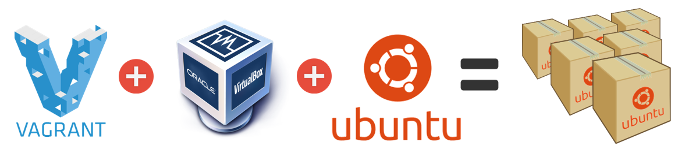

title=Steps to create a Vagrant Base Box with Ubuntu 14.04 Desktop (GUI) and VirtualBox
date=2014-05-23
author=Angel Ruiz
type=post
tags=vagrant, ubuntu, devops, virtualization, virtualbox
status=published
~~~~~~


Since the advent of the <a href="http://en.wikipedia.org/wiki/Cloud_computing#Infrastructure_as_a_service_.28IaaS.29" title="Infrastructure as a Service" target="_blank">IaaS</a> and <a href="http://en.wikipedia.org/wiki/Platform_as_a_service" title="Platform as a Service" target="_blank">PaaS</a> providers, the decline in usage of monolithic  architectures (e.g.: application server + relational DB) and the need for distributed and automatically scalable applications, as software developers we have to be increasingly more aware and skilled in the tools and techniques used to orchestrate and automate the deployment of all the different components that our architecture might end up with. 

Among these tools, normally encompassed in the DevOps space, I am currently very interested in <a href="http://www.vagrantup.com/" title="Vagrant Website" target="_blank">**Vagrant**</a>, <a href="https://www.docker.io/" title="Docker Website" target="_blank">**Docker**</a>, <a href="http://www.ansible.com" title="Ansible Website" target="_blank">**Ansible**</a> and <a href="https://juju.ubuntu.com/" title="Ubuntu JuJu Website" target="_blank">**Ubuntu JuJu**</a>. Although I already use Vagrant, today I decided I wanted to know how to create my own <a href="http://docs.vagrantup.com/v2/boxes/base.html" title="What is a Vagrant Base Box?" target="_blank">**Base Boxes**</a> that I can reuse. My idea is to have two Linux Base Boxes with Ubuntu Server and Ubuntu Desktop respectively and then another two with Windows 7 and 8. Once Vagrant is covered I want to get deeper with Docker because I see a lot of potential in lightweight containers instead of using heavy virtual machines.

<div class="index-break"></div>

Most of the guides out there focus on Linux distributions without GUI, so I decided that while I am creating my Vagrant Base Box with Ubuntu 14.04 Desktop I would document all the relevant steps next:

-----

## Step 1: Create the Virtual Machine with Virtual Box

### - Install VirtualBox
Download relevant VirtualBox installable package for your host system from the website: https://www.virtualbox.org/ 
### - Download Ubuntu ISO
I have downloaded the 64bit Desktop ISO: http://www.ubuntu.com/download/desktop
### - Define your Virtual Machine taking into consideration that:
1. The first network interface (adapter 1) must be a NAT adapter.
2. For convenience the Virtual Disk should be Dynamic (**VMDK**), so don't bee too stingy with the disk size ( >= 10GB IMO ).


### - Load the ISO as part of the VM storage and install the OS.
### - Username and Password should be: **vagrant** (for convenience, not for security).
### - Once installed unload the ISO and restart the VM.
### - Install the **"Guest Additions"**
Before installing the Guest Additions, you will have to prepare your guest system for building external kernel modules:
```
	$ sudo apt-get install dkms
	$ sudo /etc/init.d/vboxadd setup
```

and install the build-essential package and linux headers to compile the Guest Additions propertly
```
	$ sudo apt-get install -y build-essential linux-headers-server
```

Then Mount guest additions ISO via virtualbox window and follow the indications to run the installation script :


If the sytems does not install it automatically you can use the following commands:
```
	$ sudo mount /dev/cdrom /media/cdrom
	$ sudo /media/cdrom/VBoxLinuxAdditions.run
	$ sudo umount /media/cdrom
	$ sudo apt-get clean
```

## Step 2: Setup guest OS (Ubuntu 14.04 64bit) with the minimum necessary.
### - Use "Software Updater" to get latest updates. Or if you are using the command line:
```
	$ sudo apt-get update -y
	$ sudo apt-get upgrade -y
	# Restart the machine
	$ sudo shutdown -r now
```

### - Add the **vagrant** user to sudoers file:
```
	$ sudo su -
	$ visudo
	# Add the following line to the end of the file.
	vagrant ALL=(ALL) NOPASSWD:ALL
```

### - Install Vagrant Public Keys
This way we can SSH to the machine without entering the password:
```
	$ mkdir -p /home/vagrant/.ssh
	$ wget --no-check-certificate https://raw.github.com/mitchellh/vagrant/master/keys/vagrant.pub -O /home/vagrant/.ssh/authorized_keys
	# Ensure we have the correct permissions set
	$ chmod 0700 /home/vagrant/.ssh
	$ chmod 0600 /home/vagrant/.ssh/authorized_keys
	$ chown -R vagrant /home/vagrant/.ssh
```

### Install OpenSSH Server
```
	$ sudo apt-get install -y openssh-server
	$ sudo vi /etc/ssh/sshd_config
```
Ensure the following is set:

* Port 22
* PubKeyAuthentication yes
* AuthorizedKeysFile %h/.ssh/authorized_keys
* PermitEmptyPasswords no

```
	$ sudo service ssh restart
```

Save & close the file then restart SSH.

## Step 3: Package the Box
### Compact space and shut the VM down
You can remove those packages that you don't consider necessary (e.g.: LibreOffice) and execute the following commands to save space and shut the VM down:
```
	$ sudo dd if=/dev/zero of=/EMPTY bs=1M
	$ sudo rm -f /EMPTY
	# Shutdown the machine
	$ sudo shutdown -h now
```

### Create Vagrant Base Box
Asuming you already have Vagrant installed in the host system, just run the following command:
```
	$ vagrant package –-base <VitualBox VM Name>
```
in my case:
```
	$ vagrant package –-base Ubuntu-14.04-64-Desktop
```
this will create a file called **package.box**

### Install the box
```
	$ vagrant box add {boxname} package.box
```

in my case:
```
	$ vagrant box add Ubuntu-14.04-64-Desktop package.box
```

### Init a Vagrant Box by referencing the Base one we have created
Go to a different folder and type:
```
	$ vagrant init {boxname}
```

in my case:
```
	$ vagrant init Ubuntu-14.04-64-Desktop
```

### Enable GUI
Edit the generated **Vagrantfile** by uncommenting the following lines:
```
	config.vm.provider "virtualbox" do |v|
	v.gui = true
	end
```

### Spin it up!
```
	$ vagrant up
```
and you should be able to SSH the machine and see the VM running:


Please let me know if you find something that is incorrect or inaccurate.

Cheers.