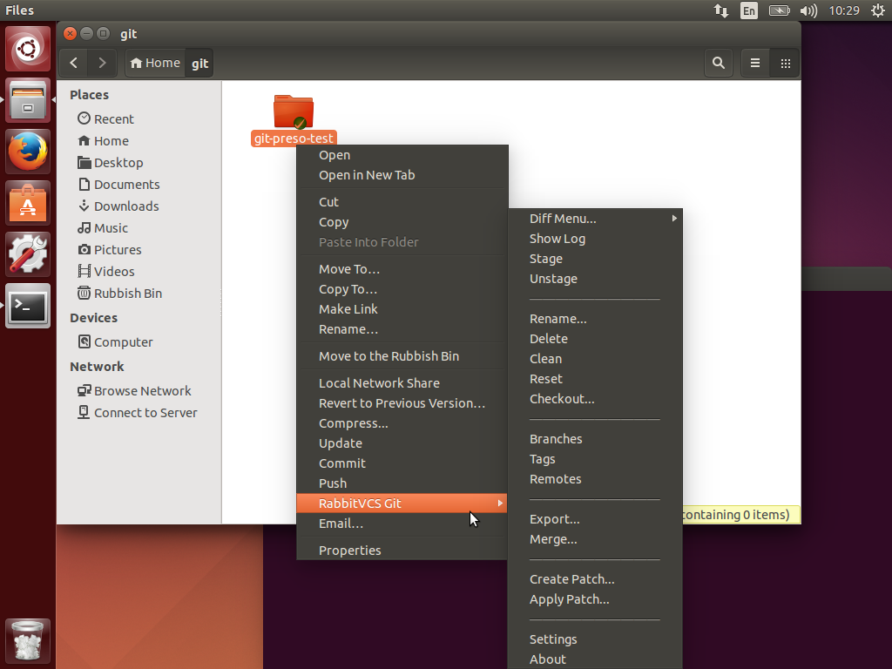

title=How to integrate RabbitVCS with Nautilus file manager in Ubuntu 14.04 Trusty Tahr
date=2014-05-27
author=Angel Ruiz
type=post
tags=ubuntu, rabbitvcs, nautilus, integration, git
status=published
~~~~~~

<a href="http://rabbitvcs.org/" title="RabbitVCS website" target="_blank">

</a>

There are still some instances of very nice applications that do not work straight away after installing them via the apt package manager and unfortunately  RabbitVCS is one of them.

<a href="http://rabbitvcs.org/" title="RabbitVCS website" target="_blank">RabbitVCS</a> is for Linux what <a href="https://code.google.com/p/tortoisegit/" title="TortoiseGit website" target="_blank">TortoiseGit</a> and <a href="http://tortoisesvn.net/" title="TortoiseSVN website" target="_blank">TortoiseSVN</a> are for the Windows platform. It is a SCM client that integrates itself with the OS file manager to manage local Git or SVN repositories.

<div class="index-break"></div>

Today I wanted to install RabbitVCS (v0.16.0) in Ubuntu 14.04 which has the tool already available in the default package repositories. So normally, it should be enough to execute the following commands and have it ready to go:
```
	$ sudo apt-get update
	$ sudo apt-get install rabbitvcs-nautilus3
    # Optional
    $ sudo apt-get install rabbitvcs-gedit
	$ sudo apt-get install rabbitvcs-cli
```

sadly that did not happen for me, so I decided to summarize the set of commands I have gathered to make it work:

* ~~Create symlinks~~

```
	$ sudo ln -sf /usr/lib/x86_64-linux-gnu/libpython2.7.so.1.0 /usr/lib/
	$ sudo ln -sf /usr/lib/x86_64-linux-gnu/libpython2.7.so.1 /usr/lib/
```
* ~~Replace RabbitVCS.py script with latest from source code~~

```
    $ wget http://rabbitvcs.googlecode.com/svn/trunk/clients/nautilus-3.0/RabbitVCS.py  /usr/share/nautilus-python/extensions
```
* Change access rights to your local RabbitCVS configuration folder. It did not worked until I did this, so previous steps might not be needed. If you try let me know please.

```
    $ chown -R $USER:$USER ~/.config/rabbitvcs
    
```

When working you should be able to see the RabbitVCS context submenu when using Nautilus like in the following snapshot:

